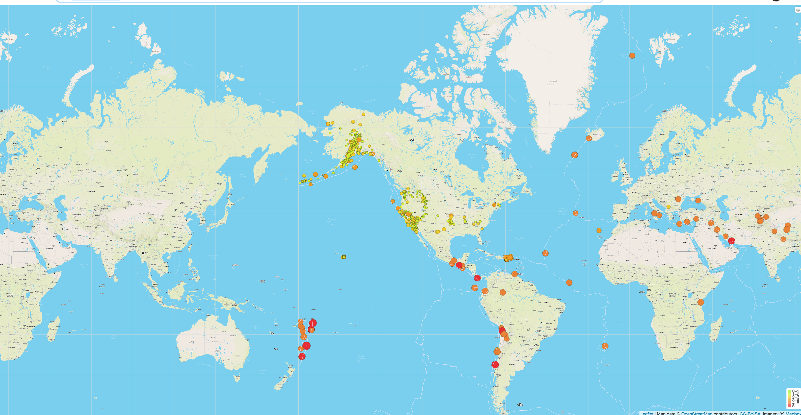

# Priyanka_Module13_-Mapping-Earthquakes-with-JS-APIs
In this module, I have used the Leaflet.js Application Programming Interface (API) to populate a geographical map with GeoJSON earthquake data from a URL. As each earthquake will be visually represented by a circle and color, where a higher magnitude will have a larger diameter and will be darker in color. In addition to which , each earthquake will have a popup marker that, when clicked, will show the magnitude of the earthquake and the location of the earthquake.
I  have added a third map style as an additional tile layer and also  added tectonic plate GeoJSON data to the map to illustrate the relationship between the location and frequency of seismic activity and tectonic plates.

This is the picture of my final result:( Zoom To See More Details in my Earthquake_challenge.png)

